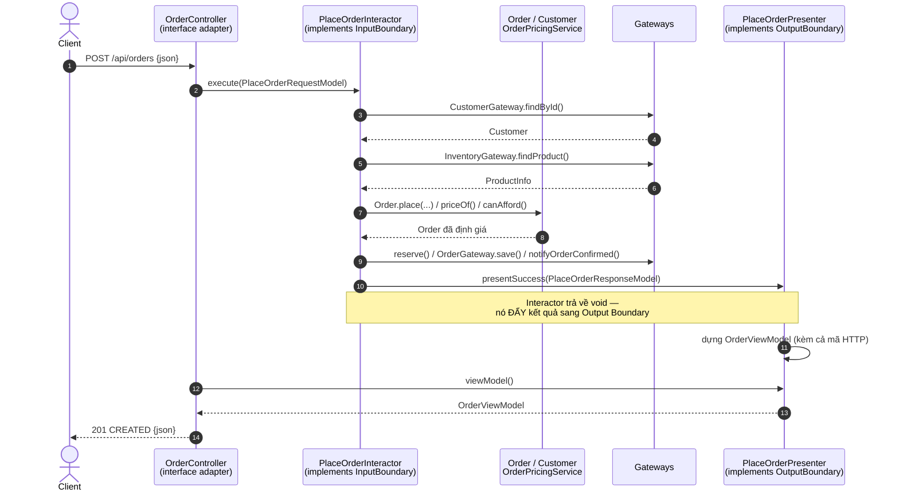

# Order: Clean Architecture vs Hexagonal Architecture

Cùng một nghiệp vụ **Đặt hàng (Place Order)** được cài đặt hai lần bằng **Java 17 + Spring Boot 3.1.5
+ Spring Data JPA + Flyway + H2**, theo đúng bố cục thư mục mẫu của dự án.

```
Clean_and_Hexagonnal_Architecture/
├── pom.xml                     POM tổng hợp (aggregator) của hai module
├── hexagonal-architecture/     com.example.orders       (khớp 1:1 với cây mẫu)
└── clean-architecture/         com.example.cleanorders  (cùng bố cục, từ vựng Clean)
```

## Chạy

```bash
# Chạy toàn bộ test của CẢ HAI module (unit test lõi + integration test qua HTTP/JPA)
mvn test

# Hoặc chạy riêng từng module
cd hexagonal-architecture && mvn test
cd ../clean-architecture   && mvn test

# Khởi động ứng dụng
mvn spring-boot:run
```

Gọi thử API:

```bash
# Đặt hàng hợp lệ -> 201
curl -X POST http://localhost:8080/api/orders \
  -H 'Content-Type: application/json' \
  -d '{"customerId":"C-01","items":[{"productId":"P-01","quantity":2}]}'

# Vượt hạn mức tín dụng -> 422
curl -X POST http://localhost:8080/api/orders \
  -H 'Content-Type: application/json' \
  -d '{"customerId":"C-02","items":[{"productId":"P-01","quantity":1}]}'
```

Dữ liệu mẫu nạp sẵn trong các outbound adapter:

| Khách hàng | Hạn mức | | Sản phẩm | Giá | Tồn kho |
|---|---|---|---|---|---|
| `C-01` Nguyen Van A | 1000.00 | | `P-01` Ban phim co | 120.00 | 10 |
| `C-02` Tran Thi B | 50.00 | | `P-02` Chuot khong day | 45.50 | 3 |
| | | | `P-03` Man hinh 27 inch | 320.00 | 0 |

---

## 1. Kịch bản nghiệp vụ (giống nhau ở cả hai bản)

| Bước | Việc làm | Ai quyết định |
|---|---|---|
| 1 | Nhận HTTP request, kiểm tra cú pháp | `OrderController` + Bean Validation |
| 2 | Tìm khách hàng | Use case, qua cổng ra |
| 3 | Kiểm tra tồn kho từng sản phẩm | Use case, qua cổng ra |
| 4 | Tạo đơn ở trạng thái `NEW` | **Entity `Order`** |
| 5 | Tính giá cuối (chiết khấu 5% nếu > 500) | **Domain service `OrderPricingService`** |
| 6 | Kiểm tra hạn mức tín dụng | **Entity `Customer.canAfford()`** |
| 7 | Giữ hàng trong kho | Use case, qua cổng ra |
| 8 | Xác nhận đơn (`NEW` → `CONFIRMED`) | **Entity `Order.confirm()`** |
| 9 | Lưu đơn xuống H2 | Use case, qua cổng ra |
| 10 | Gửi email xác nhận | Use case, qua cổng ra |
| 11 | Trình bày kết quả | **Presenter (Clean)** / **Adapter (Hexagonal)** |

Quy tắc nghiệp vụ:
- Đơn phải có 1–10 dòng hàng; số lượng mỗi dòng > 0; số tiền không âm.
- Tiền hàng = Σ (đơn giá × số lượng); đơn trên 500.00 được giảm 5%.
- Vượt hạn mức tín dụng ⇒ đơn `REJECTED` nhưng **vẫn được lưu lại** (để đối soát).
- Chỉ đơn `NEW` mới được định giá và xác nhận.

---

## 2. Hexagonal Architecture

### Sơ đồ tuần tự

```mermaid
sequenceDiagram
    autonumber
    actor Client
    participant C as OrderController<br/>(inbound adapter)
    participant M as OrderWebMapper
    participant S as PlaceOrderService<br/>(implements PlaceOrderUseCase)
    participant D as Order / Customer<br/>OrderPricingService
    participant O as Outbound adapters<br/>(qua các port out)

    Client->>C: POST /api/orders {json}
    C->>M: toCommand(PlaceOrderRequest)
    M-->>C: PlaceOrderCommand
    C->>S: placeOrder(command)
    S->>O: CustomerRepository.findById()
    O-->>S: Customer
    S->>O: InventoryPort.findProduct()
    O-->>S: ProductInfo
    S->>D: Order.place(...)
    D-->>S: Order (NEW)
    S->>D: OrderPricingService.priceOf(order)
    D-->>S: 240.00
    S->>D: customer.canAfford(240.00)
    D-->>S: true
    S->>O: reserve() / OrderRepository.save() / notifyOrderConfirmed()
    S-->>C: PlaceOrderResult
    Note over S,C: Use case TRẢ VỀ kết quả;<br/>adapter tự quyết định cách trình bày
    C->>M: toResponse(result)
    C-->>Client: 201 CREATED {json}
```

### Cấu trúc

```
hexagonal-architecture/src/main/java/com/example/orders/
├── OrdersApplication.java
├── domain/order/
│   ├── entity/       Order, OrderItem, Customer, Product,
│   │                 OrderId, CustomerId, Money, OrderStatus
│   ├── service/      OrderPricingService            <- quy tắc không thuộc riêng entity nào
│   └── exception/    DomainException, InvalidOrderException
├── application/order/
│   ├── port/in/      PlaceOrderUseCase              <- INBOUND PORT (driving)
│   ├── port/out/     OrderRepository, CustomerRepository,
│   │                 InventoryPort, NotificationPort <- OUTBOUND PORT (driven)
│   ├── usecase/      PlaceOrderService              <- cài đặt inbound port
│   └── dto/          PlaceOrderCommand, PlaceOrderResult
├── adapters/
│   ├── inbound/web/  OrderController + request/ + response/ + mapper/ + advice/
│   └── outbound/
│       ├── persistence/  JpaOrderRepositoryAdapter + springdata/ + entity/ + mapper/
│       ├── customer/     InMemoryCustomerAdapter
│       ├── inventory/    InMemoryInventoryAdapter
│       └── notification/ EmailNotificationAdapter
└── config/           UseCaseConfig, PersistenceConfig
```

---

## 3. Clean Architecture

### Sơ đồ tuần tự



### Cấu trúc

```
clean-architecture/src/main/java/com/example/cleanorders/
├── CleanOrdersApplication.java
├── domain/order/                 (giống hệt bản hexagonal)
├── application/order/
│   ├── port/in/      PlaceOrderInputBoundary        <- execute() trả về void
│   ├── port/out/     PlaceOrderOutputBoundary       <- ĐẶC TRƯNG CỦA CLEAN
│   │                 OrderGateway, CustomerGateway,
│   │                 InventoryGateway, NotificationGateway
│   ├── usecase/      PlaceOrderInteractor
│   └── dto/          PlaceOrderRequestModel, PlaceOrderResponseModel
├── adapters/
│   ├── inbound/web/  OrderController + request/ + response/ + mapper/
│   │                 presenter/ PlaceOrderPresenter, OrderViewModel   <- thêm so với hexagonal
│   └── outbound/     (giống hệt bản hexagonal, chỉ đổi tên port thành gateway)
└── config/           UseCaseConfig, PersistenceConfig
```

`PlaceOrderPresenter` giữ trạng thái của một lần gọi nên được khai báo `@RequestScope`
trong `UseCaseConfig`; Spring tạo proxy nên `PlaceOrderInteractor` (singleton) vẫn tiêm được.

---

## 4. So sánh

| Tiêu chí | Clean Architecture | Hexagonal Architecture |
|---|---|---|
| Cách chia | 4 vòng tròn đồng tâm | Lõi + hai phía trái/phải |
| Cổng vào | `PlaceOrderInputBoundary` | `PlaceOrderUseCase` (inbound port) |
| Cổng ra | `PlaceOrderOutputBoundary` + các Gateway | Các outbound port |
| Kết quả use case | **`void`**, đẩy sang Presenter | **`return PlaceOrderResult`** |
| Ai chọn mã HTTP | Presenter (qua `OrderViewModel.httpStatus`) | Controller |
| DTO ra | `PlaceOrderResponseModel` → `OrderViewModel` → JSON | `PlaceOrderResult` → JSON |
| Số lớp ở tầng web | Nhiều hơn (thêm Presenter + ViewModel) | Ít hơn |
| Nhấn mạnh | Quy tắc phụ thuộc luôn hướng vào trong | Tính đối xứng: mọi thứ ngoài lõi đều là adapter |
| Số file `.java` | 36 | 34 |

**Giống nhau (phần quan trọng nhất):**
- `domain/` là POJO thuần: không `@Entity`, không annotation Spring ⇒ unit test chạy trong vài mili giây.
- `application/` không có annotation Spring; bean được khai báo ở `config/UseCaseConfig`.
- Interface do tầng trong sở hữu, tầng ngoài cài đặt (đảo ngược phụ thuộc).
- Entity JPA (`OrderJpaEntity`) tách hẳn khỏi entity domain, nối với nhau bằng `OrderPersistenceMapper`.
- Đổi DB, đổi giao diện, đổi kênh thông báo đều không đụng vào lõi.

**Khác nhau thực chất:** chủ yếu là *từ vựng* và *cách trả kết quả*.
Clean quy định chặt hơn ở luồng ra (bắt buộc Output Boundary + Presenter + View Model);
Hexagonal gọn hơn, để adapter tự quyết định cách trình bày.

**Nên chọn cái nào?**
- Nhiều giao diện đầu ra cần định dạng riêng và muốn test được cả phần trình bày → Clean Architecture.
- Ưu tiên gọn nhẹ, nhiều hệ thống ngoài cần cắm vào → Hexagonal.

---

## 5. Ghi chú kỹ thuật

- `spring.jpa.hibernate.ddl-auto: validate` — schema do **Flyway** tạo
  (`db/migration/V1__create_orders.sql`), Hibernate chỉ kiểm tra khớp.
- **Giao dịch bao trọn use case.** `TransactionalPlaceOrderUseCase` (bản Clean:
  `TransactionalPlaceOrderInputBoundary`) nằm ở `adapters/inbound/transaction/`, bọc use case
  trong một `TransactionTemplate` duy nhất và được khai báo `@Primary` trong `UseCaseConfig`.
  Nhờ decorator này mà tầng application vẫn không có một dòng Spring nào, nhưng toàn bộ
  kịch bản vẫn chạy trong một giao dịch: hoặc ghi hết, hoặc không ghi gì.
- `OrderRepository.save()` khai báo `@Transactional(propagation = MANDATORY)`. Nếu ai đó gọi
  cổng ra ngoài giao dịch, Spring ném lỗi ngay thay vì âm thầm mở giao dịch riêng.
- **Thứ tự các bước có chủ đích**: ghi CSDL trước, gọi hệ thống kho sau. Kho là hệ thống ngoài,
  không rollback được; đặt sau bước ghi để lỗi ghi không để lại hàng bị giữ mồ côi, còn nếu
  giữ hàng hỏng thì ngoại lệ sẽ cuốn theo cả bản ghi đơn.
- **Email hoãn tới sau commit.** `EmailNotificationAdapter` đăng ký `TransactionSynchronization`
  và chỉ gửi ở mốc `afterCommit`, để khách không nhận email về đơn đã bị rollback.
  Đây là việc của adapter, use case vẫn chỉ nói "hãy báo cho khách".
- **Use case không làm mapping.** Cổng ra kho trả về entity domain `Product`; chính `Product`
  trả lời `hasStockFor(qty)` và tự dựng `orderLine(qty)`. Trước đây use case phải tự kiểm tra
  tồn kho rồi `new OrderItem(...)` từng trường một.
- **Dịch ngoại lệ tập trung.** `adapters/inbound/web/advice/DomainExceptionHandler` là nơi duy
  nhất biến ngoại lệ domain thành mã HTTP, nên `OrderController` chỉ còn một việc là định tuyến.
- Thư mục dự án nằm trên ổ exFAT nên macOS sinh file rác `._*` phá vỡ component scan.
  `pom.xml` đã cấu hình `maven-antrun-plugin` tự xoá chúng sau mỗi lần biên dịch,
  và loại chúng khỏi `maven-compiler-plugin` / `maven-surefire-plugin`.
